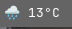

# Hey hey hey

This repo is for a shell script that uses openweathermaps free weather API.

You will need to obtain your own API key using this service for the script to work (and also have Waybar installed). This script merely serves as a template. 

To do so, visit https://openweathermap.org/price and scroll down until you find the free plan, and you can then grab your API key from there.

Once you have obtained your API key you will need to edit the template to match the API key variable to your key as well as matching the latitude and longitude to your location or the location of which you would like to get the current stats from.

To get this to work on startup if you are using Hyprland as an example. You will need to navigate to the autostart section of your config. And then add the directory to the file.
As an example, mine is located in .config/waybar/scripts/weather.sh. So I would use ```exec-once=~/.config/waybar/scripts/weather.sh``` in my config file.

In your config.jsonc you will need to add the following to the config

```jsonc
"custom/weather": {
	"format": "{}",
	"exec": "~/.config/waybar/scripts/weather.sh", // Change to your shell script directory.
	"interval": 60, // Change this yield how long until the script next executes in seconds.
	"tooltip": false
},
```

And you will then need to add "custom/weather" to your waybar module.

```jsonc
"modules-left": [
    "hyprland/workspaces",
	  "custom/weather"
]
```
^ As an example

